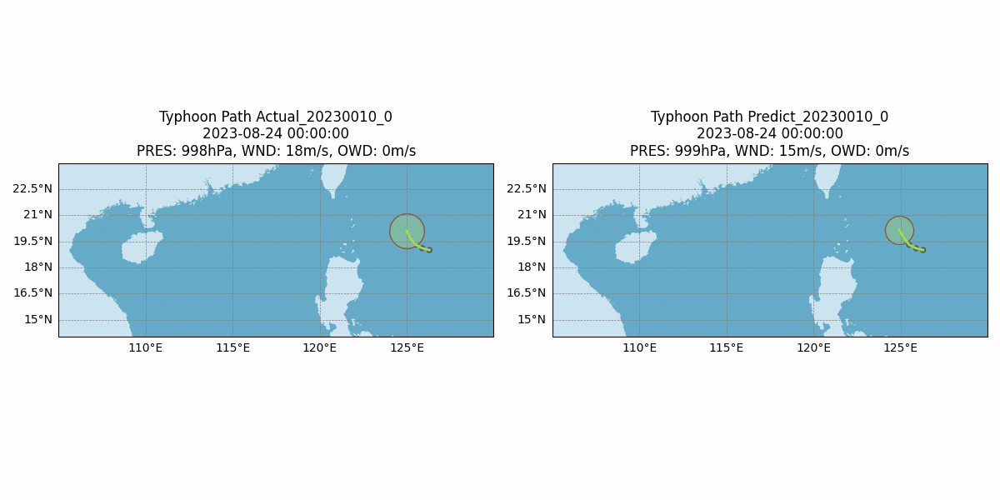

# Typhoon Path Prediction

> Mô hình dự đoán đường đi bão được triển khai bằng LSTM



## Mục lục

- [Tổng quan](#tổng-quan)
- [Cài đặt](#cài-đặt)
- [Chuẩn bị dữ liệu](#chuẩn-bị-dữ-liệu)
- [Lựa chọn đặc trưng](#lựa-chọn-đặc-trưng)
- [Huấn luyện mô hình](#huấn-luyện-mô-hình)
- [Dự đoán](#dự-đoán)
- [Giấy phép](#giấy-phép)

---

## Tổng quan

Dự án này cung cấp một quy trình hoàn chỉnh để dự đoán đường đi của bão bằng mô hình dựa trên LSTM. Mô hình dự đoán quỹ đạo của cơn bão bằng cách sử dụng dữ liệu từ 4 thời điểm trước đó để dự báo thời điểm tiếp theo. Quy trình bao gồm chuẩn bị dữ liệu, trích xuất đặc trưng, huấn luyện mô hình, dự đoán và trực quan hóa kết quả.

---

## Cài đặt

### Yêu cầu tiên quyết:
- Python 3.x
- Trình quản lý gói `pip`

### Các bước:

1. **Clone kho lưu trữ này:**
   ```bash
   git clone https://github.com/veraleiwengian/typhoon-path-prediction.git
   ```

2. **Di chuyển vào thư mục dự án:**
   ```bash
   cd typhoon-path-prediction
   ```

3. **Cài đặt các phụ thuộc:**
   ```bash
   pip install -r requirements.txt
   ```

---

## Chuẩn bị dữ liệu

Chúng tôi sử dụng [CMA Tropical Cyclone Best Track Dataset](https://tcdata.typhoon.org.cn/en/zjljsjj.html).

Để làm sạch và chuẩn bị dữ liệu, chạy lệnh:
   ```bash
   python3 data_clean.py
   ```

**Thay đổi dữ liệu:**

- Cột `END`: Ghi lại trạng thái của xoáy thuận nhiệt đới tại thời điểm hiện tại:
    - 0: Chưa kết thúc
    - 1: Tan rã
    - 2: Di chuyển ra khỏi khu vực trách nhiệm của Ủy ban Bão Tây Thái Bình Dương
    - 3: Hợp nhất
    - 4: Ở trạng thái gần như đứng yên
- Các cột `distance_km` và `bearing`: Đại diện cho khoảng cách Haversine và góc bearing từ thời điểm trước đó đến thời điểm hiện tại, cung cấp thêm thông tin không gian về chuyển động của xoáy thuận.

---

## Lựa chọn đặc trưng

Chúng tôi nâng cao biểu diễn đặc trưng của mô hình bằng các kỹ thuật sau:

- **Đặc trưng thời gian**: Chuyển đổi cột `Time` thành các biểu diễn tuần hoàn (giờ, ngày, tháng, năm) bằng phép biến đổi sine và cosine để nắm bắt các mẫu theo chu kỳ thời gian.

- **Bearing**: Góc bearing cũng được biến đổi bằng sine và cosine để bắt tốt hơn mối quan hệ góc.

- **Đặc trưng phân loại**:
    - I (Intensity) và END (Status) được mã hóa one-hot để mô hình có thể phân biệt giữa các danh mục khác nhau.

- **Chuẩn hóa**:
    - Các cột số còn lại được chuẩn hóa bằng min-max scaling để đồng bộ dữ liệu và cải thiện hiệu quả huấn luyện mô hình.

---

## Huấn luyện mô hình

Để huấn luyện mô hình:
   ```bash
   python3 train.py
   ```


**Chi tiết huấn luyện**:

- **Hàm mất mát**: SmoothL1Loss (Huber Loss), được chọn vì tính mạnh mẽ trước các giá trị ngoại lệ, cân bằng giữa L1 và L2 loss.

- **Optimizer**: AdamW, kết hợp ưu điểm của Adam (tốc độ học thích ứng) với weight decay để ngăn overfitting và cải thiện khả năng khái quát hóa.

- **Chia dữ liệu**:
    - 90% dữ liệu được sử dụng cho huấn luyện.
    - 10% được dành cho validation.

- Mô hình tốt nhất sẽ được lưu tự động dựa trên validation loss.

---

## Dự đoán

Để thực hiện dự đoán:
   ```bash
   python3 predict.py
   ```

- Bạn có thể chỉ định `typhoonID` để chạy dự đoán.
- Mô hình sử dụng dữ liệu của 4 thời điểm trước đó để dự đoán dữ liệu bão ở thời điểm tiếp theo.
- Sau khi dự đoán, một GIF so sánh dữ liệu thực tế và dữ liệu dự đoán sẽ được tạo ra.

---

## Giấy phép

Dự án này được cấp phép theo **MIT License**. Xem chi tiết tại tệp [LICENSE](https://github.com/veraleiwengian/Typhoon-Path-Prediction/blob/main/LICENSE).